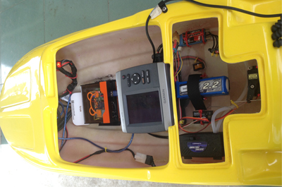

# depth_survey_rc_ship

### Our objective

Create a RC ship to carry a GARMIN GPSmap 421s to collect the depth and location. Then use these information to create a underwater topology. USB web camera is in testing phrase. We use web cam to avoid obstacle on the water.

We have
- GARMIN GPSmap 421s as a depth sensor and GPS
- RC ship
- Arduino Yun
- USB web cam
- Pocket WIFI

### Our procedure

First, we hack the GARMIN GPSmap 421s by wiring it to serial port. Using Arduino IDE with the softwareserial library to read the value GARMIN sent back to our computer. It is the NMEA code. This code return the position of GARMIN in latitude, longtitude and also return depth. With the pocket WIFI on ship, we sent this 3 data using "CURL" command on cloud. We create the Google Form to collect the data then then write them in Google Sheet. The result can pull down to plot the underwater topology in MATLAB.

  
  
  RC Ship with Arduino Yun as microcontroller and GARMIN GPSmap 421s inside

  
  
  The data from GARMIN GPSmap 421s is plotted in MATLAB

